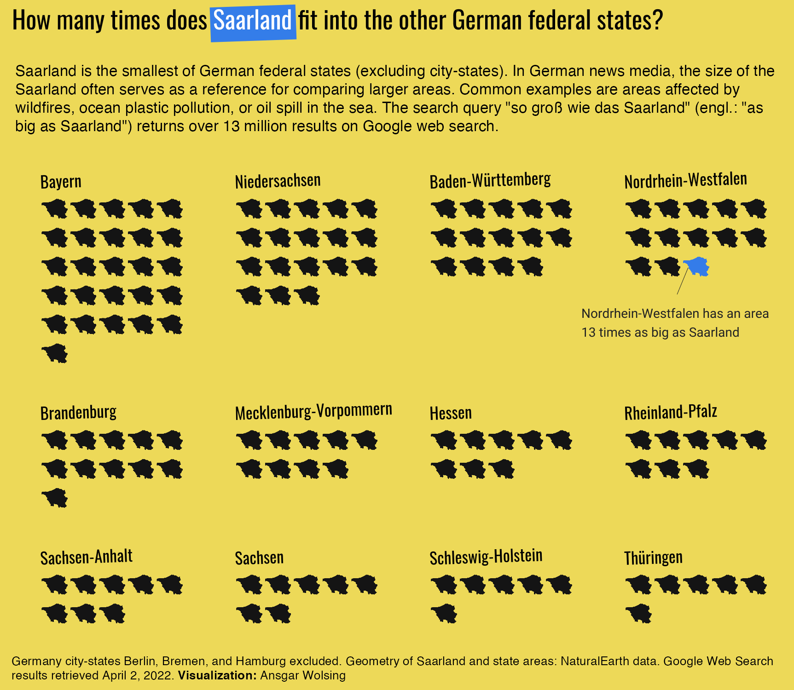
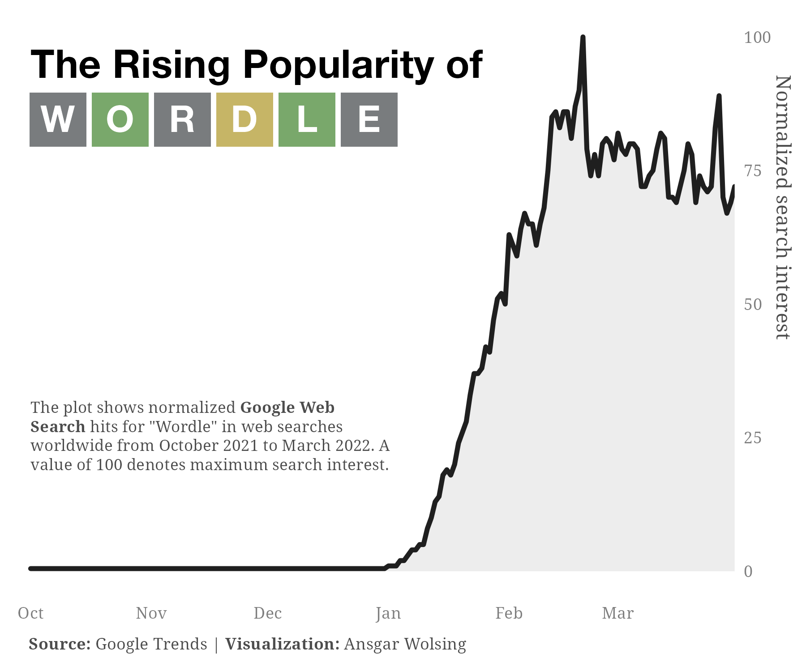
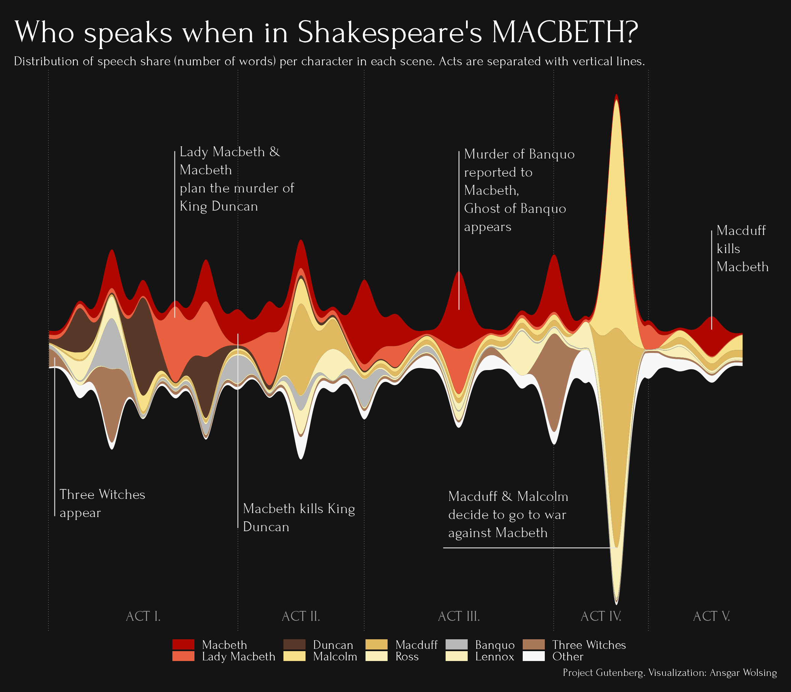

```{r setup, include=FALSE}
knitr::opts_chunk$set(echo = TRUE)
```

Contributions to the #30DayChartChallenge

## 2022

### Prompts


### My Contributions

#### Day 01 | Part-to-Whole

Code: [2022/01/waffle_renewable.R](2022/01/waffle_renewable.R)


---

#### Day 02 | Pictogram

Code: [2022/02/02-pictogram.R](2022/02/02-pictogram.R)


---

#### Day 03 | Historical

Code: [2022/03/03-historical.R](2022/03/03-historical.R)


---

#### Day 04 | Flora

Code: [2022/04/04-trees-cgn-combined.R](2022/04/04-trees-cgn-combined.R)


---

#### Day 05 | Slope

Code: [2022/05/05-slope-wordle.R](2022/05/05-slope-wordle.R)




---

#### Day 06 | Data Day: Our World in Data

Code: [2022/06/06-owid-working-hours.R](2022/06/06-owid-working-hours.R)


---

#### Day 07 | Physical

Code: [07-physical-nba.R](07-physical-nba.R)


---

#### Day 10 | Experimental

Code: [2022/10/10-experimental-macbeth.R](2022/10/10-experimental-macbeth.R)



---


