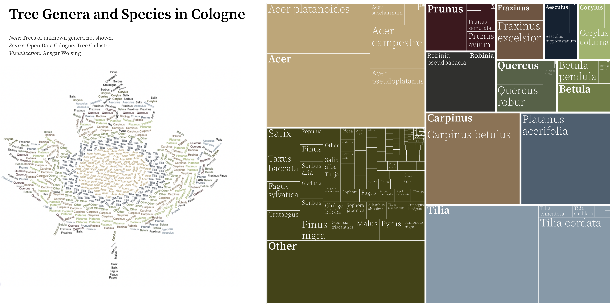

\#30DayChartChallenge
================

Contributions to the \#30DayChartChallenge

## 2022

### Prompts

### My Contributions

#### Day 01 \| Part-to-Whole

Code: [2022/01/waffle\_renewable.R](2022/01/waffle_renewable.R)

#### Day 02 \| Pictogram

Code: [2022/02/02-pictogram.R](2022/02/02-pictogram.R)

#### Day 03 \| Historical

Code: [2022/03/03-historical.R](2022/03/03-historical.R)

#### Day 04 \| Flora

Code: [2022/04/04-trees-cgn-combined.R](2022/04/04-trees-cgn-combined.R)

#### Day 05 \| Slope

Code: [2022/05/05-slope-wordle.R](2022/05/05-slope-wordle.R)

